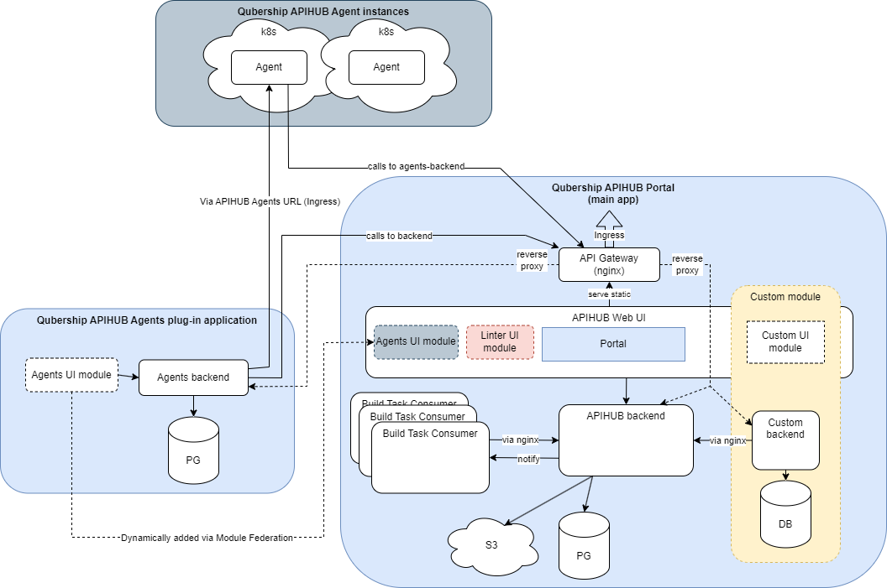

# qubership-apihub-agents-backend

A Go-based microservice backend that provides management and orchestration capabilities for [Qubership APIHUB agent](https://github.com/Netcracker/qubership-apihub-agent) instances.
This service handles agent registration, service discovery, snapshot management, and security checks.

## High Level architecture

## API Documentation

API documentation is available in the [OpenAPI specification](docs/api/Agents-Backend-API.yaml).

## Installation

This service is designed for Kubernetes deployment and uses PostgreSQL as the database.

The service is a plug-in for Qubership-APIHUB and useless without it.

Being an optional plug-in it is included into default Qubership-APIHUB delivery. Please refer to [Qubership-APIHUB Installation Notes (Helm Chart)](https://github.com/Netcracker/qubership-apihub/blob/main/docs/installation-guide.md).

Corresponding [values.yaml](https://github.com/Netcracker/qubership-apihub/blob/main/helm-templates/qubership-apihub/values.yaml) section is `qubershipApihubAgentsBackend`.

Presence of this plug-in in Qubership-APIHUB deployments enables `Agents` tab in Web UI.

## Build

Just run `build_golang_binary.cmd` file.

For Docker builds, use `build_docker_image.cmd`.
